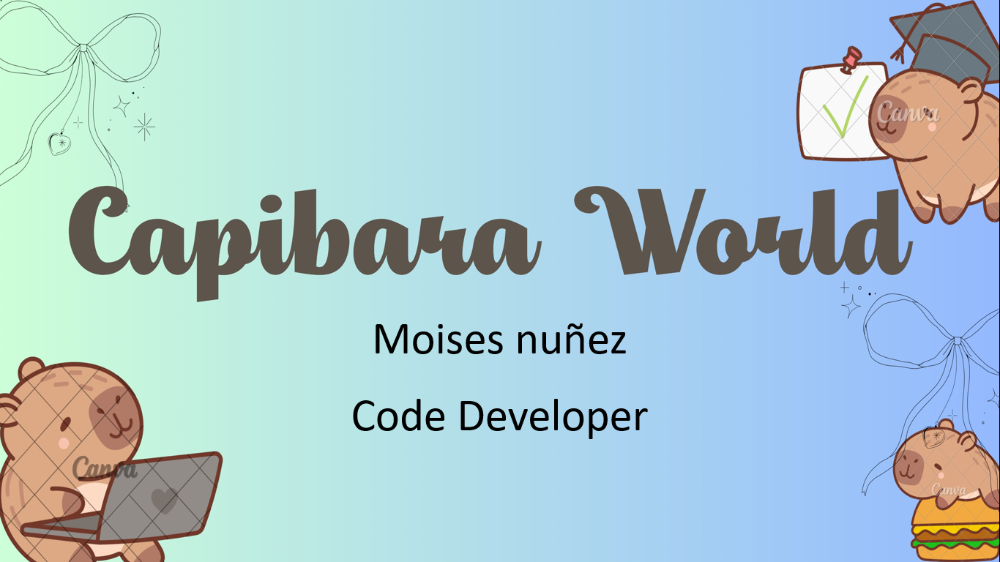

## Sobre mi

- ⭐ Programador ⭐ 
- 🙋 Acompañame a aprender mas sobre programacion
- 📓 Si, esta pagina es una tarea 
Programador experimentado en:
- Git
- GitHub
- Java
- C++

 

## Proyectos del youtuber "AristiDevs"
<table>
<tr>
<td width="50%">
<h3 align="center">Curso Android Básico</h3>

Aprende a programar aplicaciones <strong>Android con Kotlin desde cero</strong> - En este curso aprenderás todo lo necesario ya que no es necesario ningún conocimiento previo. Curso <strong>GRATUITO de 12 horas</strong> con todo el código disponible para descargar.

                                                                                      
</td>